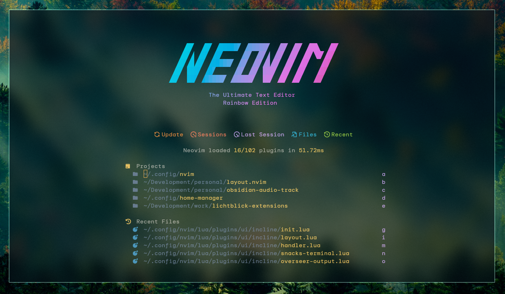
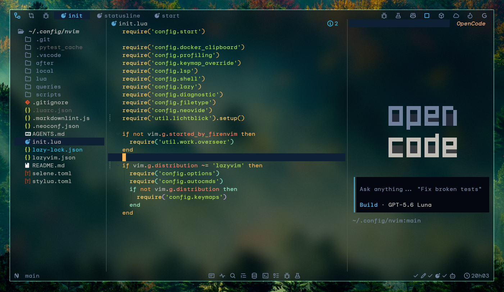

# Neovim Configuration

A clean and aesthetic Neovim configuration made for my personal use

 

<table>
  <tr>
    <td></td>
    <td></td>
  </tr>
</table>

  <a href="https://github.com/lucobellic/ayugloom.nvim">ayugloom.nvim</a>, based on the ayu theme with personal preferences. 
  <a href="https://fonts.google.com/specimen/DM+Mono">DM Mono</a> Nerd Font with added ligatures.

